<p align="center">

</p>

<h1 align="center">S I N S</h1>
<p align="center">
  <em>A First-Person Psychological Horror Investigation Game</em>
</p>

<p align="center">
  
  
  
  
</p>

---

## 🎮 About

**SINS** is a first-person psychological horror game set inside a single, claustrophobic room. You wake up with no memory of what happened — but the room remembers everything. Piece together the dark truth by examining evidence, playing cassette recordings, and unlocking secrets hidden in the furniture, walls, and shadows.

> *"He wasn't always like this. But since the accident, he talks to people who aren't there."*

---

## 🕹️ Gameplay

| Feature | Description |
|---------|-------------|
| **🔍 Evidence Investigation** | Examine a whiskey bottle, torn photographs, burned diary pages, and more — each revealing fragments of a disturbing story |
| **📼 Cassette Tape System** | Find and play cassette tapes on the gramophone to hear recorded confessions and memories |
| **🔑 Puzzle Solving** | Discover hidden keys, unlock desk drawers, and uncover what's been sealed away |
| **🚪 Locked Room Mystery** | The front door is locked. You can't leave until you confront the truth |
| **🎵 Atmospheric Audio** | Gramophone music, environmental ambience, and voice narration build tension throughout |
| **💡 Dynamic Lighting** | Antique chandelier with warm flickering light creates an unsettling, lived-in atmosphere |

---

## 🎯 Controls

| Key | Action |
|-----|--------|
| `W A S D` | Move |
| `Mouse` | Look around |
| `E` | Interact with objects |
| `ESC` | Pause menu |

---

## 📖 Story Synopsis

You find yourself inside a dimly lit room — a room that clearly belongs to someone troubled. An empty bourbon bottle sits on the desk beside a stained note dripping with guilt. A photograph from an anniversary trip has your face violently gouged out with a razor blade. A half-burned diary page whispers of accidents and people who aren't there.

As you investigate deeper — unlocking drawers with hidden keys, playing recorded confessions on an old gramophone — the pieces of a fractured life begin to assemble into something far more sinister than you expected.

**The room is your confession booth. The evidence is your jury.**


## 🗺️ Storyboard Flowchart (Narrative Progression)

```mermaid
graph TD
    A["<b>Scene 1: The Awakening</b><br/>• Pitch-black silence fades out<br/>• Player wakes in warm, nostalgic vintage room<br/>• WASD movement prompt appears in top-left corner"] --> B["<b>Scene 2: The Denial (Tape 1)</b><br/>• Objective: Find and listen to cassette tape<br/>• Pick up Tape 1 from coffee table<br/>• Play on tape deck: Calm rationalization monologue"]
    
    B --> C["<b>Scene 3: The Search for Escape</b><br/>• Objective: Search desk drawers for Tape 2<br/>• Open vintage study desk drawer<br/>• Retrieve Tape 2: 'VHSTape_WifeLore'"]
    
    C --> D["<b>Scene 4: The Confrontation (Tape 2)</b><br/>• Insert Tape 2 into player<br/>• Television flashes with violent static<br/>• Accusatory voice: <i>'Your time is officially up...'</i>"]
    
    D --> E["<b>Scene 5: The Collapse of Reality</b><br/>• Wall clock hands spin wildly out of control<br/>• Ceiling chandelier strobes and flickers<br/>• Procedural wave dissolve: Furniture, books, TV disintegrate into void"]
    
    E --> F["<b>Scene 6: The Unforgivable Act</b><br/>• Room transforms into cold, pitch-black crime scene<br/>• Confront victim body and murder weapon on floorboards<br/>• Retrieve front door brass key lying beside victim"]
    
    F --> G["<b>Scene 7: The Final Revelation & Escape</b><br/>• Unlock front door with retrieved brass key<br/>• Door opens into blinding white light<br/>• Final Message: <i>'You locked the door from the inside.'</i>"]

    style A fill:#1e1e24,stroke:#4a4a5a,stroke-width:2px,color:#fff
    style B fill:#2b261f,stroke:#d4a373,stroke-width:2px,color:#fff
    style C fill:#2b261f,stroke:#d4a373,stroke-width:2px,color:#fff
    style D fill:#4a1e1e,stroke:#e63946,stroke-width:2px,color:#fff
    style E fill:#4a1e1e,stroke:#e63946,stroke-width:2px,color:#fff
    style F fill:#16161a,stroke:#7209b7,stroke-width:2px,color:#fff
    style G fill:#0d1b2a,stroke:#48cae4,stroke-width:2px,color:#fff
```



---

## 🏗️ Technical Architecture

```
Assets/
├── GameManager.cs              # Core game state, objectives, inventory management
├── PlayerController.cs         # First-person movement and mouse look
├── EvidenceManager.cs          # Spawns and positions evidence items in the room
├── EvidenceItem.cs             # Individual evidence interaction + caption display
├── DeskInvestigation.cs        # Locked desk drawer puzzle system
├── KeyPickup.cs                # Brass key discovery and inventory
├── TapePickup.cs               # Cassette tape collection
├── TapePlayer.cs               # Gramophone tape playback system
├── GramophoneController.cs     # Background music player
├── Door.cs                     # Locked door interaction
├── ClockController.cs          # Wall clock with real-time ticking
├── CeilingLampManager.cs       # Dynamic chandelier lighting + room ambience
├── RoomStateManager.cs         # Master room setup orchestrator
├── ModernHUDManager.cs         # In-game HUD (objectives, captions, interact prompts)
├── IntroScreenManager.cs       # Atmospheric black screen fade-in sequence
├── InteractPromptUI.cs         # "Press E" proximity prompt system
└── Scenes1/
    └── MAIN.unity              # Primary game scene
```

---

## 🎨 Key Features

### Atmospheric Intro
The game opens from total blackness, holding in suspense before smoothly fading out to reveal the dimly lit room and giving full control to the player.

### Evidence System
Each piece of evidence has:
- **Proximity detection** — "Press E to Interact" appears when you approach
- **Caption overlay** — Detailed narration text appears on screen
- **Progressive storytelling** — Each item reveals a new fragment of the truth

### Atmospheric Lighting
- Warm antique chandelier with subtle flicker creates a horror ambience
- Balanced directional light keeps the room visible while maintaining shadows
- Emissive materials on chandelier arms simulate glowing filament bulbs

### Locked Room Progression
1. Find the **cassette tape** → Play it on the **gramophone**
2. Examine **evidence items** scattered around the room
3. Find the **hidden brass key** → Unlock the **desk drawers**
4. Discover the final truth → Attempt to **open the door**

---

## 🚀 Getting Started

### Prerequisites
- **Unity 6** (6000.x or later)
- **TextMeshPro** package (included with Unity)

### Setup
1. Clone the repository:
   ```bash
   git clone https://github.com/NiladriKrSahoo-dev/Buildathon-Genesis-IVWS.git
   ```
2. Open the project in **Unity Hub** → **Unity 6**
3. Open `Assets/Scenes1/MAIN.unity`
4. Press **Play** ▶️

---

## 👥 Team

Built for the **Genesis Buildathon** hackathon.

---

## 📜 Asset Credits & Third-Party Licenses

All external assets used in this project are strictly under free-to-use, commercial, or standard Unity Asset Store licenses:

| Category | Asset / Resource | Author / Source | License |
| :--- | :--- | :--- | :--- |
| **3D Environment** | Vintage Living Room Game Pack | ZNS3D (Unity Asset Store) | Standard Unity Asset Store License |
| **Character Model** | Civilian Girl Model | Mixamo / Unity Asset Store | Free Commercial License |
| **Props** | GDT Wall Clock & Furniture Prefabs | GDT / Community Assets | Standard Asset Store License |
| **Audio & SFX** | Analog Stopwatch Winding, Ambience | Freesound Community (User: freesound_community) | Creative Commons 0 (Public Domain) |
| **UI Icon** | Keyboard WASD Movement Keys | Flowicon from Noun Project | Creative Commons Attribution |
| **Typography** | Comic Neue Sans ID & Liberation Sans | Google Fonts / Unity TextMeshPro | SIL Open Font License |

---

## ⚖️ Hackathon Compliance Note
* **Engine:** Built with Unity 6.
* **Theme:** "ONE ROOM" — single contiguous room environment with no scene loading or level transitions.
* **Narrative:** Original psychological horror story & human-authored voice transcripts written specifically for the Genesis Buildathon.

---

<p align="center">
  <strong>🩸 Every room has a story. This one has a confession. 🩸</strong>
</p>
